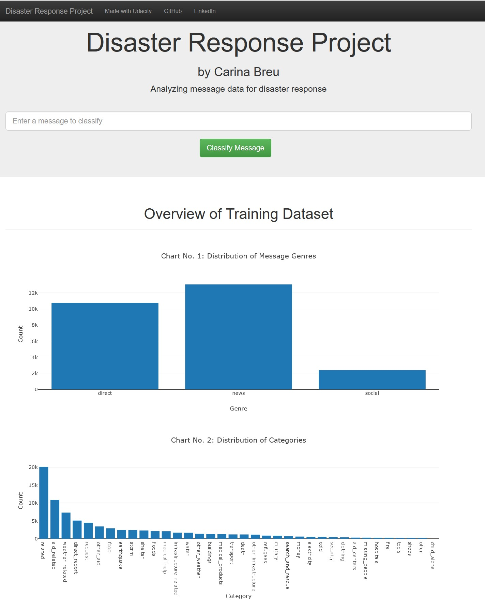
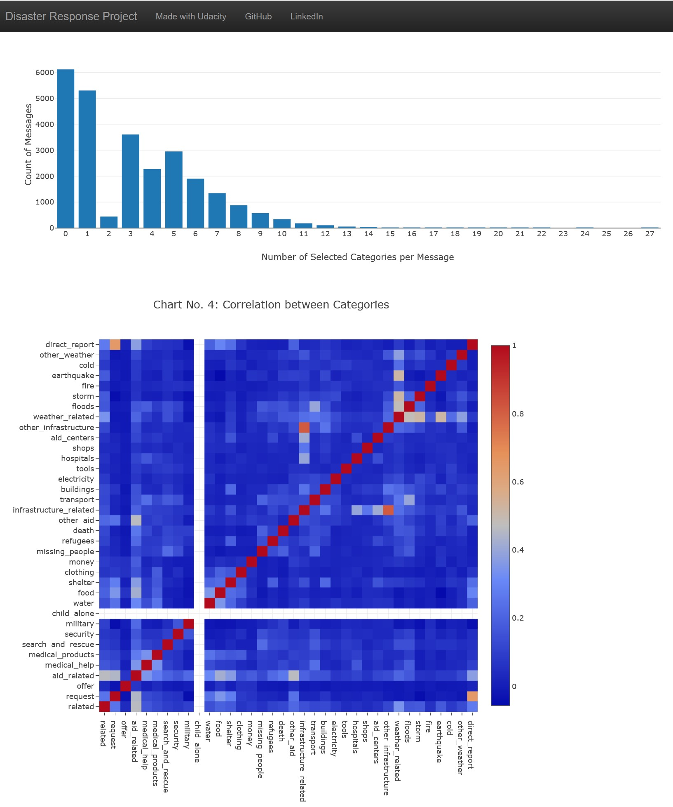
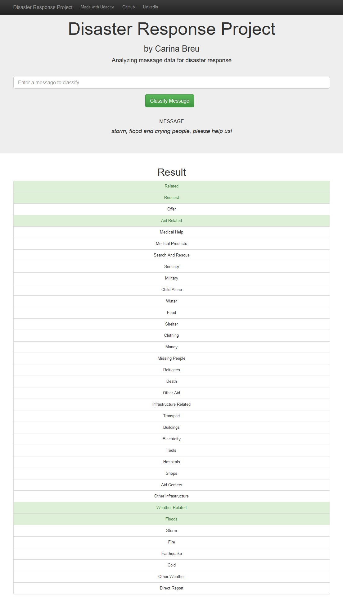

### Project Disaster Response Pipeline

## Table of Contents
1.[Installation](#installation)
2.[Project Motivation](#motivation)
3.[File Descriptions](#files)
4.[Results](#results)
5.[Licensing, Authors, and Acknowledgements](#licensing)

## Installation 

The code is written using Pythons version 3.11.0. All libraries are available within the Anaconda distribution of Python.
### Database (ETL)
To create the database, the python code process_data.py has to be executed from the folder "data". Please specify the csv files and the database (e.g. python process_data.py disaster_messages.csv disaster_categories.csv DisasterResponse.db).
The database created by this code however is also already included in the repository and will just be replaced, when the code is run again.

### Machine Learing Model (NLP-Pipeline)
The machine learning model can be trained using the code train_classifier.py from the "models" folder. Start the code by specifying the database and the file for the model (e .g. python train_classifier.py ../data/DisasterResponse.db classifier.pkl).
The result is exported into a pickle file (classifier.pkl).

### Web App
The web app can be started by executing the code run.py from the folder "app". I therefore used a venv. The code then starts the flask server and provides an IP-address where the web app can be used.

## Project Motivation 

The project "disaster response pipeline" is part of my nanodegree course in Data Science at Udacity. The program imports csv-files provided by Appen (www.appen.com) with messages during catastrophic events and categorizes them using a ML learning pipeline.
After importing the csv-files and storing them to a sqlite-database, the data is used to train a machine learning pipeline. The pipeline reads in the tokenized messages and vectorizes them and transforms them using a tfidf-transformer.
The TFIDF-transformed messages are then used to train a Multiple Output Classifier, which is based on a Random Forrest Classifier.
To improve results, GridSearch is used to find the best results for certain parameters. 

The model is finally displayed in a flask web app, where the user can enter potential messages which then are classified according to the ML model. The web app also gives an overview over the training dataset.

## File Descriptions 

The project is subdivided into three folders. 
1. data
    * disaster_categories.csv:
        The file contains the message id and categories.
    * disaster_messages.csv:
        The file contains the message id, message text, the original message and the genre.
    * DisasterResponse.db:
        Data of the csv-files are combined in the table cat_messages.
    * process_data.py:
        The program loads the CSV-files and transforms them and stores the combined data in the table cat_messages of the DisasterResponse.db
2. models
    * train_classifier.py:
        The program train_classifier.py imports data from the cat_messages table of the sqlite database DisasterResponse.db and creates a machine learning model from it. 
        Therefore the messages are tokenized, vectorized and tfidf-transformed, before they are used to train a Random Forrest Classifier for multiple outputs.
        Finally the program exports the model to the classifier.pkl pickle file.
    * classifier.pkl:
        The pickle-file stores the machine learning model, to classify messages.
3. app
    * run.py:
        The program starts the flask web server, which displays the model and contains the plotly code for the charts on the web app.
    * templates
        * master.html:
            Project Landing Page with several charts and input for classification of a custom sentence.
        * go.html:
            Classification Results of the entered message.

## Results 

Result of the project is a machine learning model, that classifies your own messages in the web app into the categories, which were available in the dataset.
The web app also shows four charts, which give a first impression about the given data, the model was trained on. 

## Licensing, Authors, Acknowledgements 

I have to thank Appen for providing the data for this exciting project and Udacity for pushing myself to the limits again and again and thereby expanding my horizon enormously.